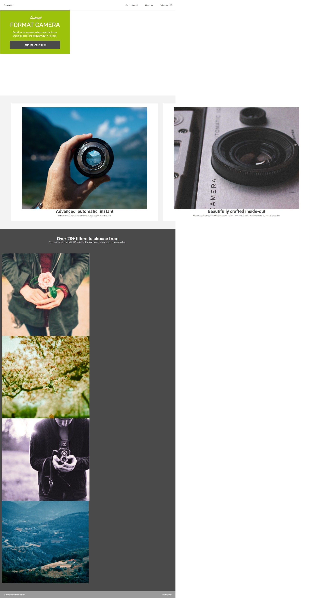

# **Fotomatic Website**
## **Features**
* A [broken website](#broken-website-provided-to-me) was provided to me and I had to fix it exactly how was expected.
* I had to fix the three version of the site for devices, mobile, tablet and desktop (Make it fully Responsive).
* I had to follow a [design spec](#design-spec).

## **Broken website provided to me**

## **Design Spec**

## **Fixed Version**

* [Here you can see the fixed version](https://necogamy.github.io/fotomatic-responsive-website/)

## **Tools Used**
* Git [You can see the broken site in a commit](#comment)
* GitHub
* A high usage of Google DevTools
* IDE: Visual Studio Code

 

### *Comment*
* During this project I was using Git and the second commit of this project it's the broken version of the site if you want to see it, you can use Git to change to that commit.